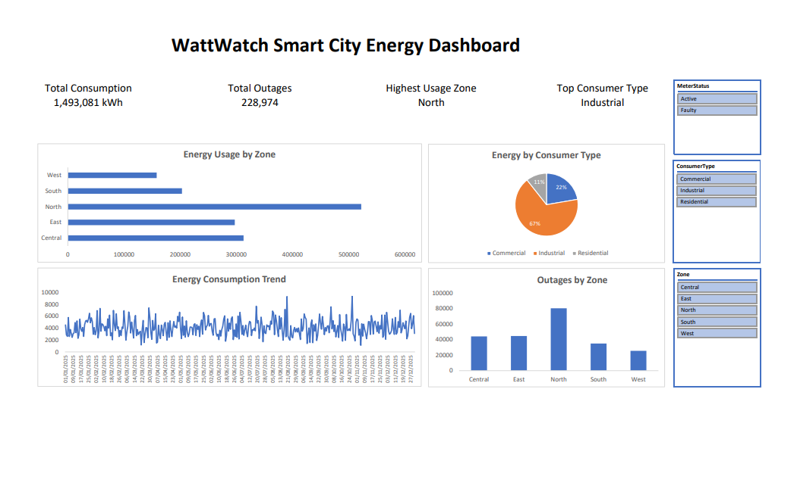
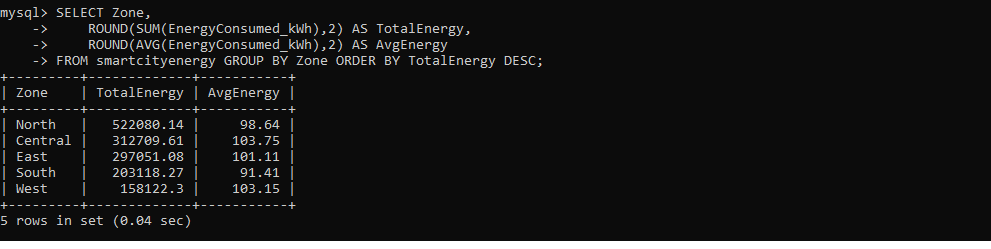
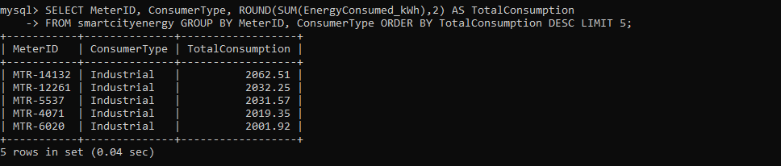
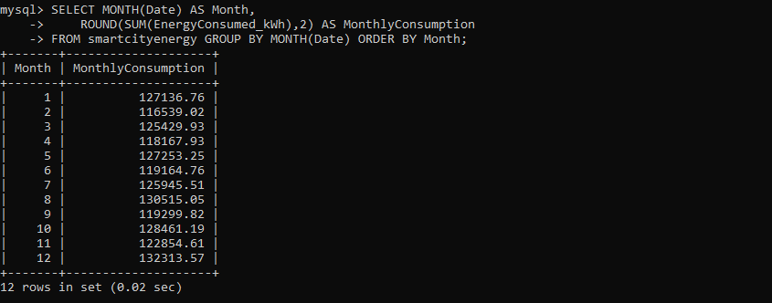
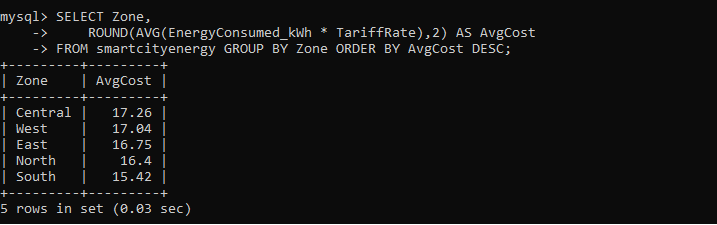
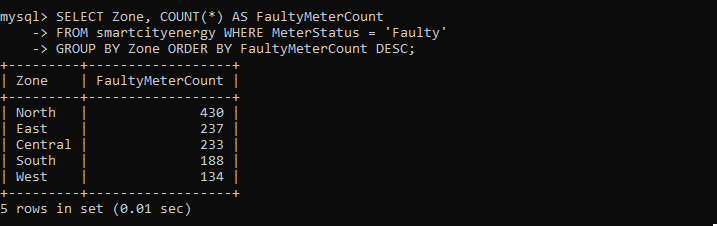
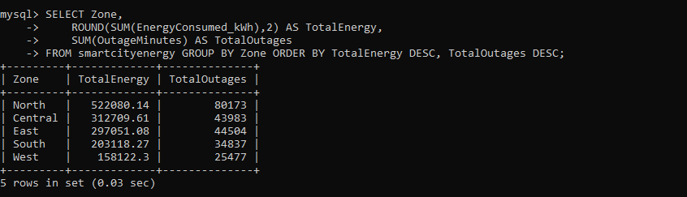
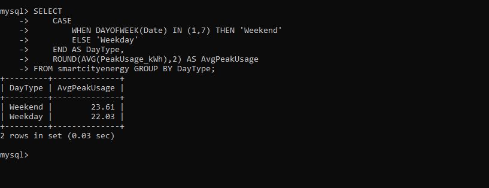

# ⚡ WattWatch: Smart City Energy Analytics Dashboard

> A data-driven urban analytics project focused on analyzing smart city energy consumption, outage reliability, and consumer behavior using **MySQL**, **Excel Dashboards**, and **Business Intelligence techniques**.

---

## 📌 Project Overview

Modern smart cities generate massive amounts of energy consumption data every day. This project analyzes urban electricity usage patterns to identify:

- 🔥 High energy consumption zones
- ⚠️ Infrastructure stress & outages
- 🏭 Consumer behavior trends
- 📈 Monthly energy usage patterns
- 💡 Data-driven recommendations for smarter cities

The project combines:

✅ SQL-based analytics  
✅ Interactive Excel dashboarding  
✅ KPI reporting  
✅ Business case study documentation  

---

# 🖼️ Dashboard Preview



---

# 🎯 Business Problem

City administrators need better visibility into:

- Which zones consume the most energy?
- Which consumer groups drive peak usage?
- Where are outages occurring most frequently?
- How can infrastructure planning be improved?

Traditional spreadsheets make it difficult to uncover actionable insights.

This project solves that problem using:
- SQL analytics
- Pivot dashboards
- KPI monitoring
- Interactive slicers

---

# 🛠️ Tech Stack

| Tool | Purpose |
|---|---|
| 🐬 MySQL | Data analysis & querying |
| 📊 Excel | Dashboard visualization |
| 📈 Pivot Tables | Dynamic aggregation |
| 📉 Pivot Charts | Interactive visuals |
| 📄 Markdown | Documentation |
| 🧠 Business Intelligence | Decision-making insights |

---

# 📂 Project Structure

```bash
WattWatch-SmartCity-Energy-Analytics/
│
├── README.md
├── watt_watch.sql
├── SmartCityEnergy.csv
├── WattWatch_CaseStudy_Report.pdf
├── SmartCityEnergy.pdf
│
└── screenshots/
    ├── dashboard.png
    ├── q1.png
    ├── q2.png
    ├── q3.png
    ├── q4.png
    ├── q5.png
    ├── q6.png
    ├── q7.png
```

---

# 📑 Table of Contents

- [📌 Project Overview](#-project-overview)
- [🎯 Business Problem](#-business-problem)
- [🛠️ Tech Stack](#️-tech-stack)
- [📂 Project Structure](#-project-structure)
- [📊 Dashboard Features](#-dashboard-features)
- [🧮 SQL Analysis](#-sql-analysis)
- [📈 Key Insights](#-key-insights)
- [💡 Recommendations](#-recommendations)
- [🔄 Project Workflow](#-project-workflow)
- [📄 Case Study Report](#-case-study-report)
- [🚀 Future Improvements](#-future-improvements)
- [👨‍💻 Author](#-author)

---

# 📊 Dashboard Features

The dashboard was built using:
- Excel Pivot Tables
- Pivot Charts
- KPI Cards
- Interactive Slicers

### Included Visuals

✅ Energy Usage by Zone  
✅ Consumer Type Distribution  
✅ Energy Consumption Trend  
✅ Outages by Zone  
✅ Dynamic KPI Cards  
✅ Interactive Filtering System  

---

## 🎯 KPI Metrics

| KPI | Value |
|---|---|
| ⚡ Total Consumption | 1,493,081 kWh |
| ⚠️ Total Outages | 228,974 |
| 🏙️ Highest Usage Zone | North |
| 🏭 Top Consumer Type | Industrial |

---

# 🧮 SQL Analysis

The project uses MySQL queries to perform:

- Zone-wise energy analysis
- Top consumer identification
- Monthly trend analysis
- Cost analysis
- Fault detection analysis
- Energy efficiency analysis

---

## 📌 Query 1 — Energy Consumption by Zone

```sql
SELECT 
    Zone,
    ROUND(SUM(EnergyConsumed_kWh),2) AS TotalEnergy,
    ROUND(AVG(EnergyConsumed_kWh),2) AS AvgEnergy
FROM smartcityenergy
GROUP BY Zone
ORDER BY TotalEnergy DESC;
```

### 📸 Output



---

## 📌 Query 2 — Top 5 Energy Consumers

```sql
SELECT 
    MeterID,
    ConsumerType,
    ROUND(SUM(EnergyConsumed_kWh),2) AS TotalConsumption
FROM smartcityenergy
GROUP BY MeterID, ConsumerType
ORDER BY TotalConsumption DESC
LIMIT 5;
```

### 📸 Output



---

## 📌 Query 3 — Monthly Energy Consumption Trend

```sql
SELECT 
    MONTH(Date) AS Month,
    ROUND(SUM(EnergyConsumed_kWh),2) AS MonthlyConsumption
FROM smartcityenergy
GROUP BY MONTH(Date)
ORDER BY Month;
```

### 📸 Output



---

## 📌 Query 4 — Average Cost per Zone

```sql
SELECT 
    Zone,
    ROUND(AVG(EnergyConsumed_kWh * TariffRate),2) AS AvgCost
FROM smartcityenergy
GROUP BY Zone
ORDER BY AvgCost DESC;
```

### 📸 Output



---

## 📌 Query 5 — Faulty Meters by Zone

```sql
SELECT 
    Zone,
    COUNT(*) AS FaultyMeterCount
FROM smartcityenergy
WHERE MeterStatus = 'Faulty'
GROUP BY Zone
ORDER BY FaultyMeterCount DESC;
```

### 📸 Output



---

## 📌 Query 6 — Energy Efficiency Analysis

```sql
SELECT 
    Zone,
    ROUND(SUM(EnergyConsumed_kWh),2) AS TotalEnergy,
    SUM(OutageMinutes) AS TotalOutages
FROM smartcityenergy
GROUP BY Zone
ORDER BY TotalEnergy DESC, TotalOutages DESC;
```

### 📸 Output



---

## 📌 Query 7 — Weekday vs Weekend Peak Usage

```sql
SELECT 
    CASE
        WHEN DAYOFWEEK(Date) IN (1,7) THEN 'Weekend'
        ELSE 'Weekday'
    END AS DayType,
    ROUND(AVG(PeakUsage_kWh),2) AS AvgPeakUsage
FROM smartcityenergy
GROUP BY DayType;
```

### 📸 Output



---

# 📈 Key Insights

## 🏙️ North Zone Recorded Highest Energy Usage
The North zone consumed the most electricity, indicating higher urban activity and infrastructure demand.

---

## 🏭 Industrial Consumers Dominated Usage
Industrial consumers accounted for the majority of total energy consumption.

---

## ⚠️ High Outages Suggest Infrastructure Stress
North zone also experienced the highest outage duration, indicating potential infrastructure overload.

---

## 📊 Energy Demand Fluctuated Throughout the Year
Daily consumption trends showed significant spikes during several periods.

---

## 🎛️ Interactive Filtering Improved Analysis
Dashboard slicers enabled real-time exploration of:
- zones
- consumer types
- meter statuses

---

# 💡 Recommendations

### ✅ Upgrade High-Demand Infrastructure
Prioritize North zone for infrastructure modernization.

### ✅ Improve Predictive Maintenance
Monitor outage-heavy regions proactively.

### ✅ Optimize Industrial Energy Usage
Industrial sectors should adopt load-balancing strategies.

### ✅ Expand Smart Monitoring Systems
Real-time dashboards can improve operational efficiency.

### ✅ Use Predictive Analytics
Historical data can improve future energy planning.

---

# 🔄 Project Workflow

```text
CSV Dataset
     ↓
MySQL Database
     ↓
SQL Analysis
     ↓
Pivot Tables
     ↓
Excel Dashboard
     ↓
Business Insights
     ↓
Case Study Report
```

---

# 📄 Case Study Report

A complete business case study report was also created for this project.

📘 Includes:
- Introduction
- Dataset overview
- SQL analysis
- Dashboard explanation
- Findings
- Recommendations
- Conclusion

---

# 🚀 Future Improvements

- 🔮 Predictive energy forecasting
- 🌐 Power BI integration
- ☁️ Real-time IoT smart meter streaming
- 🤖 Machine learning anomaly detection
- 📱 Mobile dashboard optimization

---

# 🧠 Learning Outcomes

Through this project, I developed practical experience in:

- SQL aggregation & filtering
- Business intelligence dashboarding
- Data storytelling
- KPI development
- Interactive reporting
- Urban analytics
- Business case study writing

---

# 👨‍💻 Author

## Dushyant Vasoya

📊 Aspiring Data Analyst & Business Intelligence Enthusiast

### Skills Demonstrated
- SQL
- Excel Dashboarding
- Data Visualization
- KPI Analytics
- Business Intelligence
- Data Storytelling

---

# ⭐ If You Like This Project

Feel free to:
- ⭐ Star the repository
- 🍴 Fork the project
- 📢 Share feedback


---

# 📜 License

This project is intended for educational and portfolio purposes.
